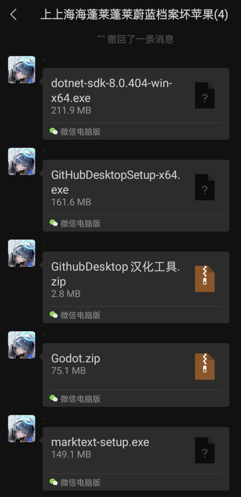
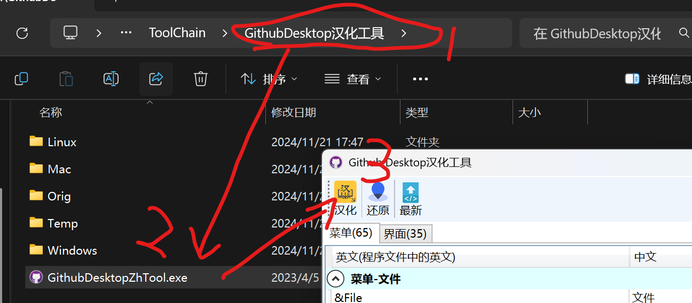

# TODO：

## 确保以下软件被安装：

~~（真的要把这些东西放到github仓库里吗，这也太大了）~~

~~论如何用github下载github desktop~~

## 功能说明：

**dotnet-sdk：** 调试godot项目所需要的依赖，按照安装程序指导安装即可

**GitHubDesktop：** 多人合作管理项目文件的工具，这样我们就不需要一直在群里传文件了，按照安装程序指导安装即可

**GitHubDesktop汉化工具：** 如果你对你的英语水平有信心可以不下，使用方式：先安装好github desktop，下载之后解压缩，然后

**Godot：** 游戏引擎、编辑器，解压缩到你希望的位置即可

**marktext：** markdown文件编辑器，~~因为所有人都痛恨Microsoft Word所以~~用markdown来代替word吧，按照安装程序指导安装即可

~~**VSCode：** 大抵用不上，不放了

~~